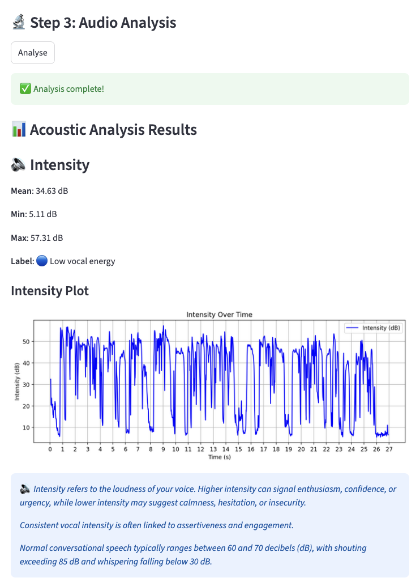
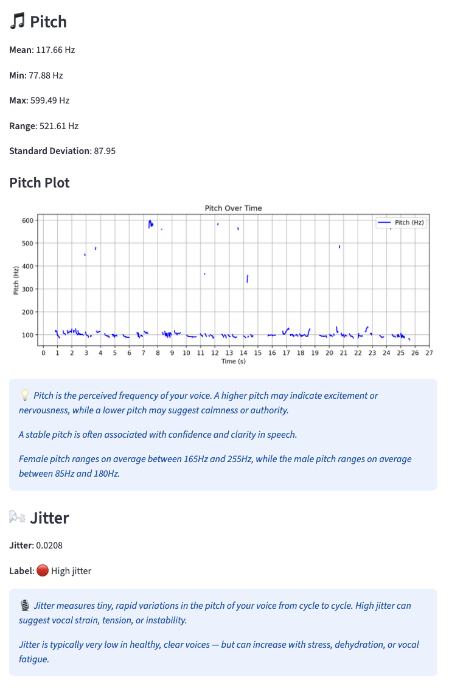

# 🗣️ Speech Analyser App

An interactive Streamlit app that analyses recorded or uploaded speech 
for vocal fluency, filler words, long pauses, and acoustic clarity — 
using Whisper for transcription, Praat-Parselmouth for acoustic feature 
extraction, and custom heuristics for fluency scoring.

Built as a tool for language learners and public speakers who want 
objective, data-driven feedback on their delivery.

The app is designed around two layers of analysis:

- **Surface layer** (available in the live demo): Whisper transcription, 
  filler word detection, pause flagging, and Praat-based acoustic metrics 
  (pitch, intensity, jitter, shimmer).

- **Phoneme layer** (local only): When Montreal Forced Aligner (MFA) is 
  available, the app additionally aligns the transcript to the audio at 
  the level of individual sounds — enabling precise timing analysis of 
  specific phonemes. This opens the door to pronunciation feedback at a 
  granularity that word-level transcription alone cannot achieve.

🌐 **Live demo:** https://speech-analyser.streamlit.app/

> ⚠️ The live demo runs the full Whisper + Praat pipeline. MFA phoneme 
> alignment requires local setup and is disabled on the hosted version.

---

## 🧠 Features

- 🎙 Upload or record your own voice
- 🗯 Detect filler words (customisable list)
- ⏸ Flag long pauses above a configurable threshold
- 🎚 Analyse pitch, intensity, jitter and shimmer via Praat
- 📊 Visual feedback with coaching-style summaries
- 🔬 Phoneme-level alignment via MFA (local only — see below)

## 📸 Screenshots

**Acoustic Analysis — Intensity over time**


**Acoustic Analysis — Pitch and Jitter over time**  


---

## 🚀 Quickstart
```bash
git clone https://github.com/alexdimmock95/speech-analyser.git
cd speech-analyser

python3 -m venv venv
source venv/bin/activate  # Windows: venv\Scripts\activate

pip install -r requirements.txt

streamlit run app.py
```

---

## 🛠️ Dependencies

### Python Packages
- `streamlit` — web app interface
- `numpy` — numerical operations
- `matplotlib` — plotting
- `librosa` — audio processing
- `soundfile` — audio file I/O
- `parselmouth` — Praat integration for acoustic analysis
- `openai-whisper` — speech transcription

### System Dependencies
- **FFmpeg** — required by librosa and Whisper:
  - macOS: `brew install ffmpeg`
  - Ubuntu: `sudo apt-get install ffmpeg`
  - Windows: download and add to PATH

---

## 🔬 MFA Phoneme Alignment (Local Only)

Montreal Forced Aligner (MFA) adds phoneme-level timing to the 
analysis — it aligns the transcript to the audio at the level of 
individual sounds rather than words. This enables more precise 
fluency analysis but requires a separate local environment due to 
its dependencies.

### Why a separate environment?
MFA has heavy dependencies that conflict with the main app packages. 
The app calls MFA via a subprocess, keeping your working environment clean.
```bash
conda create -n mfa_env python=3.10
conda activate mfa_env
pip install montreal-forced-aligner
```

You will also need to download the English acoustic model and 
pronunciation dictionary from the 
[MFA model repository](https://mfa-models.readthedocs.io/en/latest/).

> ⚠️ The acoustic model and dictionary files are too large to 
> include in this repo (~2GB+). Download them separately and update 
> the paths in `run_mfa.sh` to point to your local copies.

### Bash
The MFA component uses `run_mfa.sh`. On Windows, use WSL or Git Bash.

---

## 📁 Project Structure
```
├── app.py              # Main Streamlit app
├── run_mfa.sh          # Bash script for MFA alignment
├── requirements.txt    # Python dependencies
├── output/             # Analysis outputs (not tracked in Git)
```

---

## ⚠️ Limitations

### Acoustic Metric Sensitivity
Jitter and shimmer measurements are sensitive to background noise, 
microphone quality, and recording environment. In noisy conditions, 
Praat may produce elevated readings that don't reflect genuine vocal 
instability. Similarly, pitch tracking can misfire on unvoiced segments 
or noise, producing outlier Hz values that skew statistics.

> For best results, use a clean microphone input in a quiet environment.

### Label Granularity
The current feedback labels (e.g. 🔴 High jitter, 🔵 Low vocal energy) 
are applied globally across the entire recording. This means a speaker 
who is confident for most of a recording but hesitates briefly in one 
section will receive the same label as someone who hesitates throughout. 
Richer feedback would require time-localised labelling — flagging *where* 
in the audio a metric deteriorates, not just whether it does overall.

### MFA Deployment Constraints
Montreal Forced Aligner is powerful but difficult to deploy in cloud 
environments due to its size (~2GB+ models) and conda-based dependency 
structure. The phoneme alignment component is therefore only available 
when running the app locally with MFA installed in a separate conda 
environment. A future version might explore lighter forced alignment 
alternatives such as `wav2vec2`-based alignment, which can run without 
MFA entirely.

---

## 🔮 Future Plans

- **Time-localised feedback** — flag specific moments in the audio where 
  pitch, intensity or fluency metrics deteriorate, rather than 
  summarising across the whole recording
- **Richer coaching labels** — move from binary labels (high/low) to 
  contextual feedback tailored to the speaker's pattern across the 
  recording
- **Lightweight phoneme alignment** — explore wav2vec2-based forced 
  alignment as a cloud-deployable alternative to MFA
- **Multi-language support** — extend transcription and analysis to 
  non-English input, leveraging Whisper's multilingual capabilities
- **Visual phoneme timeline** — display phoneme boundaries overlaid on 
  the acoustic plots

---

## 🙌 Credits

- [Montreal Forced Aligner](https://montreal-forced-aligner.readthedocs.io/)
- [Praat-Parselmouth](https://github.com/YannickJadoul/Parselmouth)

---

## 📝 License

MIT License — see `LICENSE` for details.